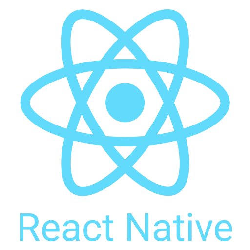

## Hi! I'm Pedro Gollo! 👋🏻

  
  
  

  
  

---

### Who am I?

<small>EN-US</small>

👨🏻‍💻 Full Stack developer at Nomad Innovation.  
📚 Studying Software Engineering at Universidade de Caxias do Sul / Universidade de Coimbra.  
💡 Focus on learning and growing in the ever-evolving field of Information Technology.

<small>PT-BR</small>

👨🏻‍💻 Desenvolvedor Full Stack na Nomad Innovation.  
📚 Estudante de Engenharia de Software na Universidade de Caxias do Sul / Universidade de Coimbra.  
💡 Foco em aprender e crescer no campo em constante evolução da Tecnologia da Informação.

---

## Technology Stack

<table>
<tr>
<td align="center" valign="top">

### Frontend

 

</td>
<td align="center" valign="top">

### Backend

 

</td>
</tr>

<tr>
<td align="center" valign="top">

### Mobile

</td>
<td align="center" valign="top">

### Database

</td>
</tr>
</table>
